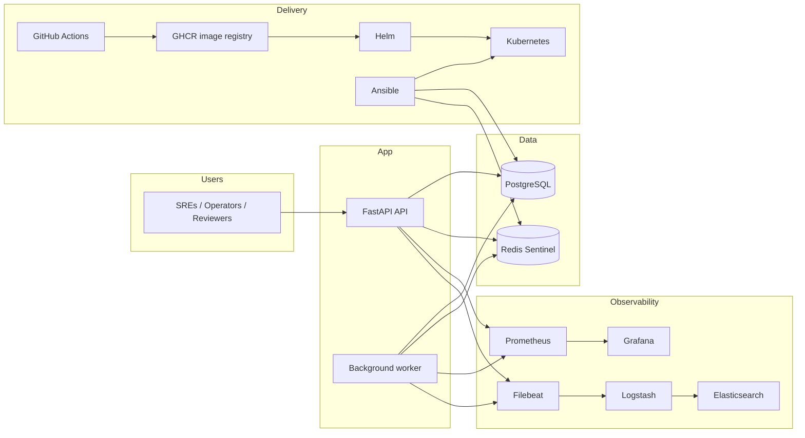

# Uptime Monitor


Uptime Monitor is a portfolio-grade SRE project for monitoring HTTP endpoints end to end. It combines a FastAPI API, a dedicated background worker, PostgreSQL, Redis Sentinel, Docker, Kubernetes, Helm, Ansible, Prometheus/Grafana, and an ELK log pipeline into one coherent delivery story.

## Tech Stack

- FastAPI application with a separate worker process
- PostgreSQL for durable target and check history storage
- Redis Sentinel for cached status and resilience experiments
- Docker for containerized packaging
- Kubernetes and Helm for environment-specific deployment
- Ansible for infrastructure provisioning and service automation
- Prometheus, Grafana, Elasticsearch, Logstash, Filebeat, and rsyslog for observability
- GitHub Actions and GHCR for build, ship, and rollout automation

## Architecture



## What This Project Demonstrates

- a clean split between API traffic and background execution
- PostgreSQL plus Redis Sentinel as a realistic production data layer
- container-first packaging with Docker
- Kubernetes and Helm deployment with `dev`, `qa`, and `prod` values
- GitHub Actions -> GHCR -> Helm -> rollout verification delivery flow
- Ansible-driven provisioning for application and infrastructure services
- Prometheus and Grafana for metrics, dashboards, and SLO/error-budget experiments
- ELK-based log shipping, indexing, and retention
- health probes, metrics endpoints, and operational readiness thinking

## Kubernetes and Helm

The Helm chart lives in [`helm/uptime-monitor`](./helm/uptime-monitor) and supports environment-specific values files:

- [`values-dev.yaml`](./helm/uptime-monitor/values-dev.yaml)
- [`values-qa.yaml`](./helm/uptime-monitor/values-qa.yaml)
- [`values-prod.yaml`](./helm/uptime-monitor/values-prod.yaml)

Deployment is automated through [`.github/workflows/kubernetes-deploy.yml`](./.github/workflows/kubernetes-deploy.yml):

- builds a Docker image
- pushes it to GHCR
- installs `kubectl` and `Helm`
- lints the chart
- injects runtime secrets from GitHub Secrets
- runs a Helm upgrade/install
- verifies API and worker rollouts

## CI/CD

The pipeline is intentionally portfolio-friendly and production-shaped:

- `main` branch triggers the Kubernetes deployment workflow
- GitHub Actions builds the image from the exact commit SHA
- GHCR stores the image artifact
- Helm deploys into the selected namespace
- rollout checks confirm the workload is healthy before the job exits

## Ansible

Ansible handles the infrastructure side of the story:

- provisioning of app, database, cache, exporter, and observability services
- Kubernetes bootstrap, control plane, worker, and addon roles
- repeatable systemd/service management
- environment-specific group variables and inventory

Useful entry points:

- [`ansible/playbooks/site.yml`](./ansible/playbooks/site.yml)
- [`ansible/playbooks/k8s-control-plane.yml`](./ansible/playbooks/k8s-control-plane.yml)
- [`ansible/playbooks/k8s-worker.yml`](./ansible/playbooks/k8s-worker.yml)
- [`ansible/playbooks/k8s-monitoring.yml`](./ansible/playbooks/k8s-monitoring.yml)

## Observability

This repository is built to be observable, not just runnable:

- Prometheus scrapes API, worker, node, PostgreSQL, and Redis metrics
- Grafana presents service health, latency, and error-budget views
- the log pipeline moves application and system logs through Filebeat and Logstash into Elasticsearch
- ELK retention is configured for a realistic operations lifecycle
- SLO and error-budget experiments are part of the dashboarding story

## Quick Start

```bash
git clone https://github.com/N4L34/uptime-monitor.git
cd uptime-monitor
pip install -r requirements.txt
uvicorn app.main:app --reload
```

Then open:

- API docs: `http://127.0.0.1:8000/docs`
- metrics: `http://127.0.0.1:8000/metrics`
- example API flows: [`docs/api-examples.md`](./docs/api-examples.md)

## Repository Layout

```text
app/           FastAPI app, worker, metrics, cache, and config
ansible/       provisioning, inventory, roles, and playbooks
helm/          Kubernetes Helm chart and environment values
k8s/           raw Kubernetes manifests and examples
infra/         Prometheus, logging, and service configuration
migrations/    database migrations
docs/          short supporting documentation
tests/         automated tests
```

## Why It Stands Out

This is not just an app repo. It is a compact, realistic operations showcase that ties together application code, runtime packaging, deployment automation, monitoring, logging, and rollout safety into one readable system.
